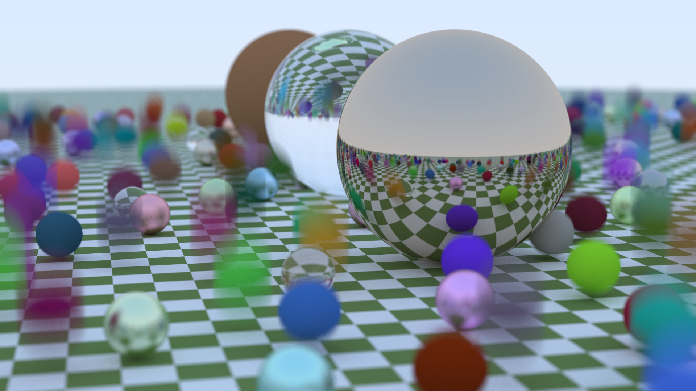

# C++17-based Ray Tracing

The project is based on the book [Ray Tracing in One Weekend](https://raytracing.github.io/).

**On Unix-like systems**:

```bash
cmake -S . -B ./build -DCMAKE_BUILD_TYPE=Release
cmake --build ./build --parallel
./bin/Release/Ray-Tracing --config-file-path config/weekend/sky.json --output-file-path result/weekend/sky.png
```

**On Windows**:

```powershell
cmake -S . -B ./build
cmake --build ./build --config Release --parallel
.\bin\Release\Ray-Tracing.exe --config-file-path config\weekend\sky.json --output-file-path result\weekend\sky.png
```

## Gallery

These results are rendered on Windows 11 platform with Visual Studio 2022.

### Weekend

|                Configuration File Name                |                                        Result                                         |
| :---------------------------------------------------: | :-----------------------------------------------------------------------------------: |
|      [weekend/sky.json](config/weekend/sky.json)      |                 [](result/weekend/sky.png)                 |
|   [weekend/sphere.json](config/weekend/sphere.json)   |              [](result/weekend/sphere.png)              |
|  [weekend/diffuse.json](config/weekend/diffuse.json)  |          [](result/weekend/diffuse-10.png)          |
|  [weekend/diffuse.json](config/weekend/diffuse.json)  |          [](result/weekend/diffuse-30.png)          |
|  [weekend/diffuse.json](config/weekend/diffuse.json)  |          [](result/weekend/diffuse-50.png)          |
|  [weekend/diffuse.json](config/weekend/diffuse.json)  |          [](result/weekend/diffuse-70.png)          |
|  [weekend/diffuse.json](config/weekend/diffuse.json)  |          [](result/weekend/diffuse-90.png)          |
|  [weekend/diffuse.json](config/weekend/diffuse.json)  |    [](result/weekend/diffuse-gamma-10.png)    |
|  [weekend/diffuse.json](config/weekend/diffuse.json)  |    [](result/weekend/diffuse-gamma-30.png)    |
|  [weekend/diffuse.json](config/weekend/diffuse.json)  |    [](result/weekend/diffuse-gamma-50.png)    |
|  [weekend/diffuse.json](config/weekend/diffuse.json)  |    [](result/weekend/diffuse-gamma-70.png)    |
|  [weekend/diffuse.json](config/weekend/diffuse.json)  |    [](result/weekend/diffuse-gamma-90.png)    |
| [weekend/material.json](config/weekend/material.json) |            [](result/weekend/material.png)            |
|      [weekend/fov.json](config/weekend/fov.json)      |           [](result/weekend/fov-close.png)           |
|      [weekend/fov.json](config/weekend/fov.json)      | [](result/weekend/fov-close-defocused.png) |
|      [weekend/fov.json](config/weekend/fov.json)      |             [](result/weekend/fov-far.png)             |
|  [weekend/weekend.json](config/weekend/weekend.json)  |             [](result/weekend/weekend.png)             |

### Week

|                  Configuration File Name                  |                               Result                                |
| :-------------------------------------------------------: | :-----------------------------------------------------------------: |
|       [week/checker.json](config/week/checker.json)       |       [](result/week/checker.png)       |
|   [week/two-spheres.json](config/week/two-spheres.json)   |   [](result/week/two-spheres.png)   |
|         [week/earth.json](config/week/earth.json)         |         [](result/week/earth.png)         |
|        [week/perlin.json](config/week/perlin.json)        |        [](result/week/perlin.png)        |
|          [week/quad.json](config/week/quad.json)          |          [](result/week/quad.png)          |
|         [week/light.json](config/week/light.json)         |         [](result/week/light.png)         |
|   [week/cornell-box.json](config/week/cornell-box.json)   |   [](result/week/cornell-box.png)   |
| [week/cornell-smoke.json](config/week/cornell-smoke.json) | [](result/week/cornell-smoke.png) |
|          [week/week.json](config/week/week.json)          |          [](result/week/week.png)          |

### Life

|                 Configuration File Name                 |                              Result                               |
| :-----------------------------------------------------: | :---------------------------------------------------------------: |
|  [life/cornell-box.json](config/life/cornell-box.json)  |  [](result/life/cornell-box.png)  |
|       [life/mirror.json](config/life/mirror.json)       |       [](result/life/mirror.png)       |
|        [life/glass.json](config/life/glass.json)        |        [](result/life/glass.png)        |
| [life/mirror-glass.json](config/life/mirror-glass.json) | [](result/life/mirror-glass.png) |
